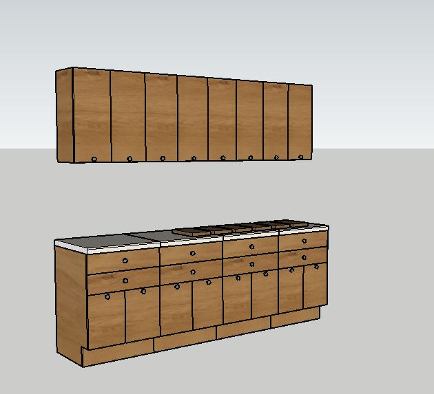
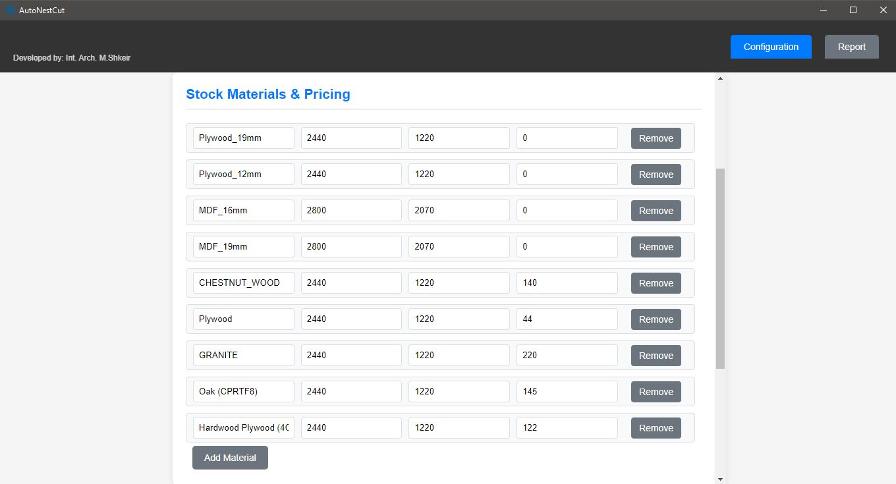
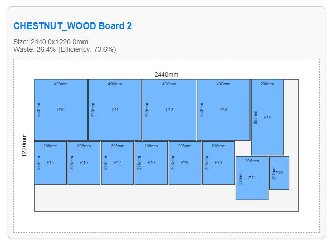
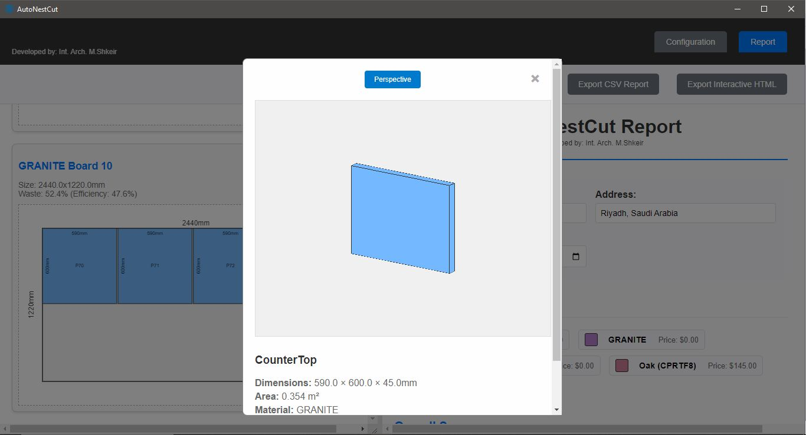
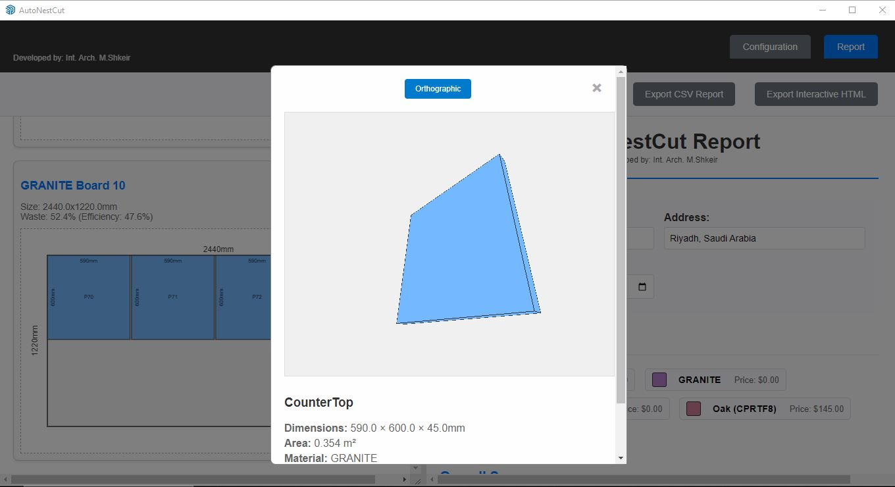

# AutoNestCut - Professional Cut List Generator for SketchUp

**Developed by: Int. Arch. M.Shkeir**

---

## 📋 Table of Contents

- [Overview](#overview)
- [Key Features](#key-features)
- [System Requirements](#system-requirements)
- [Installation](#installation)
- [Quick Start Guide](#quick-start-guide)
- [Detailed User Guide](#detailed-user-guide)
- [Configuration Options](#configuration-options)
- [Understanding Reports](#understanding-reports)
- [Export Formats](#export-formats)
- [Advanced Features](#advanced-features)
- [Tips for Best Results](#tips-for-best-results)
- [Troubleshooting](#troubleshooting)
- [Support & Contact](#support--contact)
 - [Local Documentation (example)](#local-documentation-example)

---

## 🎯 Overview

AutoNestCut is a professional SketchUp extension designed for woodworkers, furniture makers, cabinet makers, and architects who need to optimize material usage and generate cutting diagrams for sheet goods. The extension automatically analyzes your 3D model components and creates efficient nesting layouts to minimize waste and reduce costs.

*Example: Kitchen cabinet model ready for cut list generation*

### Why AutoNestCut?

- **Save Money**: Minimize material waste with optimized nesting
- **Save Time**: Automated cut list generation in seconds
- **Professional Results**: Workshop-ready cutting diagrams
- **Accurate Costing**: Real-time material cost calculations
- **Export Flexibility**: PDF, CSV, and interactive HTML formats

---

## ⚡ Key Features

### 🔍 **Intelligent Component Detection**
- Automatically identifies sheet good components in your model
- Works with nested components and grouped assemblies
- Recursive deep search through all model levels
- Supports complex furniture assemblies (drawers, cabinets, etc.)

### 🎯 **Advanced Material Management**
- Custom material database with pricing
- Automatic material detection from SketchUp materials
- Visual material highlighting in 3D model
- Sort and filter materials by usage
- Import/export material databases

### 🔄 **Optimized Nesting Algorithm**
- Minimizes waste through efficient part arrangement
- Optional part rotation for better material utilization
- Configurable kerf width for accurate cutting
- Real-time efficiency calculations

### 📊 **Comprehensive Reporting**
- Visual cutting diagrams with part labels
- Detailed material lists and costs
- Component hierarchy tree structure
- Interactive 3D part visualization
- Professional project documentation

### 💾 **Multiple Export Formats**
- **PDF**: Print-ready cutting diagrams
- **CSV**: Spreadsheet-compatible data
- **Interactive HTML**: Self-contained reports with 3D views

---

## 💻 System Requirements

- **SketchUp**: Version 2020 or later
- **Operating System**: Windows 10/11, macOS 10.14+
- **Memory**: 4GB RAM minimum, 8GB recommended
- **Storage**: 50MB free space

---

## 🚀 Installation

### Method 1: Extension Manager (Recommended)
1. Download the AutoNestCut extension files
2. Open SketchUp
3. Go to **Window > Extension Manager**
4. Click **Install Extension**
5. Select the downloaded `.rbz` file
6. Restart SketchUp

### Method 2: Manual Installation
1. Extract extension files to your SketchUp Plugins directory
2. Load the extension using: `load 'path/to/load_extension.rb'`
3. The extension will appear in **Extensions > AutoNestCut** menu

### Verification
- Look for the AutoNestCut toolbar icon
- Check **Extensions > AutoNestCut** menu is available

---

## 🏃‍♂️ Quick Start Guide

### Step 1: Prepare Your Model
- Create your furniture/project in SketchUp
- Make each sheet good part a separate component
- Apply materials to components (optional but recommended)

### Step 2: Select Components
- Select all components you want in your cut list
- Can select individual parts or entire assemblies
- Extension works with nested and grouped components

### Step 3: Launch AutoNestCut
- Click the toolbar icon or go to **Extensions > AutoNestCut**
- The configuration window will open

### Step 4: Configure Settings
- Set kerf width (saw blade thickness)
- Enable/disable part rotation
- Configure stock materials and pricing

### Step 5: Generate Cut List
- Click **"Generate Cut List"**
- Review results in the Report tab
- Export as needed (PDF, CSV, HTML)

---

## 📖 Detailed User Guide

### Component Preparation

#### ✅ Best Practices
- **Individual Components**: Make each sheet good part a separate component
- **Realistic Dimensions**: Ensure parts have proper thickness (3-50mm)
- **Material Assignment**: Apply SketchUp materials to components
- **Logical Grouping**: Group related components (drawer assemblies, cabinet boxes)
- **Clear Naming**: Use descriptive component names

#### 🔧 Working with Complex Assemblies
AutoNestCut intelligently handles:
- **Nested Components**: Components inside other components
- **Grouped Assemblies**: Groups containing multiple components  
- **Mixed Hierarchies**: Any combination of groups and components
- **Deep Nesting**: Unlimited nesting levels supported

### Material Management

*Configure materials with dimensions and pricing*

#### Material Detection
The extension automatically detects materials from:
1. **Component Materials**: Materials applied to component instances
2. **Face Materials**: Materials applied to faces within components
3. **SketchUp Materials**: Materials from your model's material library
4. **Component Names**: Names containing material keywords

#### Material Database Features
- **Sorting Options**: Alphabetical, by usage, most used first
- **Usage Filtering**: Show only used materials
- **Visual Highlighting**: Click eye button (👁️) to highlight components in 3D
- **Import/Export**: CSV format for database management
- **Default Materials**: Load common sheet good materials

### Configuration Options

#### General Settings
| Setting | Description | Default | Range |
|---------|-------------|---------|-------|
| **Kerf Width** | Saw blade thickness for cutting allowance | 3.0mm | 0-10mm |
| **Allow Rotation** | Permits rotating parts for better nesting | Enabled | On/Off |

#### Stock Materials
| Field | Description | Example |
|-------|-------------|---------|
| **Material Name** | Descriptive identifier | "Plywood_19mm" |
| **Width** | Sheet width in millimeters | 2440mm |
| **Height** | Sheet height in millimeters | 1220mm |
| **Price** | Cost per sheet | $45.00 |

---

## 📊 Understanding Reports

### Report Sections

#### 1. **Materials Used**
- Lists all materials with associated costs
- Click material names to scroll to cutting diagrams
- Color-coded for easy identification

#### 2. **Overall Summary**
Key project metrics:
- Total parts count
- Number of boards needed
- Material efficiency percentage
- Total project cost

#### 3. **Cutting Diagrams**

*Generated cutting diagrams with part labels and dimensions*

Visual layouts showing:
- Part arrangement on each sheet
- Dimensions and labels
- Material identification
- Board numbering
- Efficiency calculations

**Interactive Features:**
- Click parts to view in 3D
- Hover for part information
- Zoom and pan diagrams

#### 4. **Component Tree Structure**
Toggle-able hierarchical view showing:
- Material groupings (📁)
- Individual components (📦)
- Dimensions and quantities
- Nested relationships

#### 5. **Detailed Tables**

**Unique Part Types**
- Consolidated list of different parts
- Quantities and total areas
- Material assignments

**Board Types Summary**
- Different sheet materials needed
- Quantities and costs
- Total material requirements

**Parts Placement**
- Every part instance listed
- Board assignments
- Cutting sequence

### 3D Part Visualization

 

**Interactive 3D Viewer:**
- Click any part in cutting diagrams
- Orthographic/Perspective toggle
- Orbit, pan, and zoom controls
- Part dimensions and details
- Material information

---

## 💾 Export Formats

### 📄 PDF Export
**Perfect for workshop use**
- Print-ready cutting diagrams
- Complete part lists and specifications
- Professional formatting
- All diagrams and tables included

**Example**: `pdf_output_example.pdf`

### 📊 CSV Export
**Spreadsheet integration**
- Excel/Google Sheets compatible
- Inventory management ready
- Cost analysis data
- Custom processing capability

**Example**: `Cutting_List_cutlist_model_10.csv`

### 🌐 Interactive HTML Export
**Digital sharing and collaboration**
- Self-contained report file
- Full 3D part visualization
- Interactive cutting diagrams
- Resizable and responsive
- No internet connection required

**Example**: `AutoNestCut_Interactive_Report.html`

---

## 🔧 Advanced Features

### Material Highlighting System
- **Visual Verification**: Click eye button (👁️) to highlight components
- **3D Model Integration**: Selected components highlighted in SketchUp
- **Clear Highlighting**: Remove all highlights with one click
- **Workflow Integration**: Keep extension window small for side-by-side viewing

### Performance Optimizations
- **Material Caching**: Intelligent caching reduces processing time by 90%
- **Single-Pass Processing**: Optimized algorithms for large projects
- **Selective Entity Search**: Focuses only on selected components
- **Memory Efficient**: Handles complex models without performance issues

### Project Documentation
- **Project Information**: Name, address, date fields
- **Professional Headers**: Branded report headers
- **Custom Branding**: Developer attribution included
- **Date Stamping**: Automatic date assignment

---

## 💡 Tips for Best Results

### Model Preparation
- ✅ **Component Structure**: Make each sheet good part an individual component
- ✅ **Material Assignment**: Apply materials consistently
- ✅ **Realistic Dimensions**: Use actual material thicknesses
- ✅ **Logical Grouping**: Group related components for organization
- ✅ **Clear Naming**: Use descriptive component names

### Material Management
- ✅ **Stock Sizes**: Configure actual available sheet sizes
- ✅ **Accurate Pricing**: Update material costs regularly
- ✅ **Kerf Allowance**: Set appropriate kerf width for your tools
- ✅ **Grain Direction**: Consider wood grain when allowing rotation

### Workflow Optimization
- ✅ **Selection Strategy**: Select complete assemblies rather than individual parts
- ✅ **Material Verification**: Use highlighting feature to verify material assignments
- ✅ **Regular Exports**: Save material databases for reuse
- ✅ **Documentation**: Fill in project information for professional reports

### Performance Tips
- ✅ **Selective Processing**: Only select components needed for cut list
- ✅ **Model Cleanup**: Remove unnecessary geometry before processing
- ✅ **Component Optimization**: Use component instances rather than unique components
- ✅ **Material Consistency**: Use consistent material naming

---

## 🔧 Troubleshooting

### Common Issues

#### Components Not Detected
**Problem**: Parts not appearing in cut list

**Solutions**:
- Ensure parts are components, not loose geometry
- Check thickness is between 3-50mm
- Verify minimum area requirements are met
- Use material highlighting to verify detection

#### Poor Nesting Efficiency
**Problem**: High material waste

**Solutions**:
- Enable part rotation if grain direction allows
- Adjust stock sheet sizes to match available materials
- Check kerf width settings
- Consider breaking large assemblies into smaller parts

#### Material Detection Issues
**Problem**: Incorrect or missing materials

**Solutions**:
- Apply materials directly to components
- Use material highlighting to verify assignments
- Check component names for material keywords
- Manually assign materials in stock materials section

#### Performance Issues
**Problem**: Slow processing or crashes

**Solutions**:
- Select only necessary components
- Reduce model complexity
- Close other applications to free memory
- Process large projects in smaller batches

### Error Messages

| Error | Cause | Solution |
|-------|-------|----------|
| "No valid sheet goods found" | No components meet size criteria | Check component dimensions and structure |
| "No components selected" | Empty selection | Select components before running extension |
| "Processing error" | Model complexity or corruption | Simplify model or check for errors |

---

## 📞 Support & Contact

### 🐛 Report Issues
Found a bug or need help? Contact us with:
- Brief description of the issue

## Local Documentation (example)

A compact, branded HTML user guide that includes screenshots and quick references is available in the repository under the `example/` folder:

- Open `example/EXTENSION_DOCUMENTATION.html` in your browser to view a user-friendly, styled documentation that uses the extension UI styles and the screenshots included in `example/`.

This file is intended as a convenient, offline, developer-friendly user guide for distribution and demonstration purposes.
- Steps to reproduce the problem
- Expected vs actual behavior
- Your SketchUp version and operating system

### 🌐 Connect with Int. Arch. Moe Shkeir

**Professional Profiles:**
- **Behance**: [muhamadshkeir](https://www.behance.net/muhamadshkeir)
- **LinkedIn**: [muhammad-s-shkeir](http://www.linkedin.com/in/muhammad-s-shkeir)

**Social Media:**
- **Instagram**: [@muhamad.a.shk](https://www.instagram.com/muhamad.a.shk/)
- **Business Instagram**: [@archi4.design](https://www.instagram.com/archi4.design/)

**Direct Contact:**
- **Email**: muhamad.shkeir@gmail.com

### 📚 Additional Resources
- **Documentation**: This README file
- **Example Files**: Check the `example/` folder for sample outputs
- **Video Tutorials**: Available on our social media channels

---

## 📄 License & Copyright

© 2024 AutoNestCut Extension. All rights reserved.

**Developed with passion for efficient woodworking and design.**

This extension is commercial software. Unauthorized distribution or modification is prohibited. For licensing inquiries, please contact the developer.

---

## 🔄 Version History

**Current Version: 2024**
- Advanced recursive component detection
- Material highlighting system
- Tree structure visualization
- Interactive 3D part viewer
- Multiple export formats
- Professional reporting system

---

*Thank you for choosing AutoNestCut for your woodworking and design projects!*